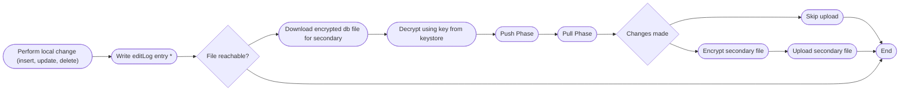
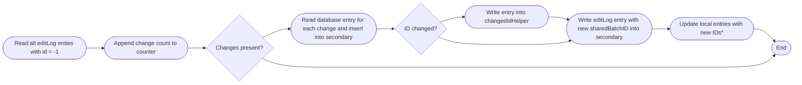
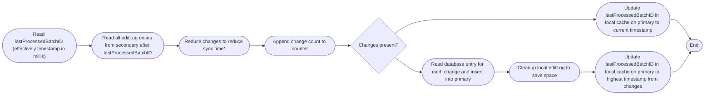

# DB Sync diagram and description

Pure Budget features a unique way to sync changes between multiple instances. To make it more obvious to other people it will be pictured and explained here.
Synchronization is realised using an external encrypted file. The file serves as a tranfer database similar to a secondary node.
This means there are multiple primary nodes using a common secondary to communicate asynchronously.
Therefore no extra database server is needed to process changes.
All instances primarily use their own internal database. Every change generates an editLog entry.
In the second step the editLog entry is used to append the changes to the secondary node.

## Requirements

- primary and secondary node have all tables to be synced in common
- local editLog entries to be synced have the id "-1"

## Full Process



\* Params: ```affectedTable <String>, affectedId <int>, type <String>, sharedBatchID <int>```

## Push-Phase



\* IMPORTANT: reversed order to avoid ID conflicts and update editLog in case the script fails in next step

## Pull-Phase



\* if affectedTable and affectedId change a reduce is performed by type:

- insert + delete => no action
- update + delete => no action
- insert + update + delete => no action
- insert + update => insert (due to sync logic)
- update => update
- insert => insert
- delete => delete
  - as IDs are not assigned twice even if an entry was deleted a simple detection is enough

### Notes

- Updating sharedBatchIDs on local is not necessary as the log is emptied at the end
- It is only necessary if the editLog is to be kept
